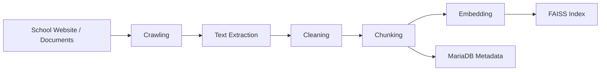

# 무한 Assistant
가천대학교 학사·행정 문서 기반 LLM+RAG Q&A 챗봇

## 1. Overview
Infinity Assistant는 가천대학교 학사·행정 정보를 대상으로 한
LLM+RAG 기반 Q&A 챗봇 서비스입니다.

사용자는 자연어로 질문을 입력하고,
시스템은 사전에 수집, 전처리, 임베딩된 학교 공식 문서를 검색한 뒤
관련 근거를 바탕으로 답변을 생성합니다.

답변과 함께 원문 출처를 제공하여
기존 검색 시스템과 일반 챗봇의 한계를 보완하는 것을 목표로 했습니다.

2. Problem
가천대학교의 학사·행정 정보는 홈페이지, 공지사항, 학사요람, PDF, HWP 등
여러 경로에 분산되어 있어 사용자가 원하는 정보를 빠르게 찾기 어렵습니다.

기존 학교 검색은 키워드 기반 검색에 의존하기 때문에
질문의 의도와 직접적으로 관련 없는 결과가 상단에 노출되는 문제가 있었습니다.

또한 기존 챗봇은 웹 검색으로 접근 가능한 정보에는 대응할 수 있지만,
PDF나 학사요람처럼 파일 형태로 제공되는 공식 문서 기반 질문에는 한계가 있었습니다

3. Solution
본 프로젝트는 학교 공식 문서를 직접 수집하고,
전처리·청킹·임베딩 과정을 거쳐 FAISS 기반 벡터 인덱스를 구축했습니다.

사용자 질문이 입력되면 질문을 임베딩한 뒤
유사한 문서 청크를 검색하고,
검색 결과를 LLM 프롬프트에 포함하여
근거 기반 답변을 생성합니다.

이를 통해 사용자는 여러 문서와 페이지를 직접 탐색하지 않고도
필요한 정보를 자연어 질문 하나로 확인할 수 있습니다.

4. Key Features
- 자연어 기반 학사·행정 Q&A
- 학교 공식 문서 크롤링 및 파일 수집
- PDF / HTML 문서 텍스트 추출
- 텍스트 전처리 및 정규화
- 문서 chunking 및 metadata 저장
- OpenAI Embedding 기반 벡터화
- FAISS 기반 유사 문서 검색
- MariaDB 기반 chunk metadata 관리
- RAG 기반 답변 생성
- 답변 출처 제공
- 문맥 확장 및 re-ranking 기반 검색 품질 개선

5. System Architecture

## 6. RAG Pipeline
사용자 질문은 embedding vector로 변환된 뒤
FAISS 인덱스에서 의미적으로 유사한 문서 청크를 검색합니다.

검색된 FAISS ID는 chunk ID로 변환되고,
MariaDB에 저장된 원문, 문서명, URL, metadata를 조회합니다.

이후 검색된 context를 query를 기반으로 Cross-encoder를 이용, rerank 후 
최종 top k개를 LLM 프롬프트를 구성하여 문서에 근거한 답변을 생성합니다.

7. Data Pipeline

8. Evaluation
RAGAS를 사용하여 retrieval 품질과 generation 품질을 분리 평가했습니다.

| Metric | Score |
|---|---:|
| Faithfulness | 0.9000 |
| Answer Relevancy | 0.6305 |
| Context Precision | 0.7373 |
| Context Recall | 0.7625 |

Faithfulness가 높게 나타나 답변이 검색된 문서 근거에서 크게 벗어나지 않는다는 점을 확인했습니다.
반면 Answer Relevancy는 상대적으로 낮아, 질문 의도에 더 직접적으로 맞는 답변 생성과
context 선별 개선이 필요함을 확인했습니다.

9. Tech Stack
### AI / RAG
- gpt-oss-20b
- qwen2.5-7b
- OpenAI GPT-4.1
- OpenAI Embedding API
- FAISS
- RAGAS

### Database
- MariaDB

### Data Collection
- BeautifulSoup
- Selenium
- pdfplumber

### Frontend
- React
- TypeScript
- Vite
- Tailwind CSS

### Backend
- Python
- FastAPI
- Uvicorn

10. Limitations & Future Work
- 단일 청크 중심 검색에서는 문맥 단절 문제가 발생할 수 있습니다.
- Answer Relevancy 개선을 위해 re-ranking과 문맥 확장 로직을 추가로 고도화할 필요가 있습니다.
- 학교 문서는 학기와 연도에 따라 변경되므로 주기적인 크롤링 및 인덱스 갱신이 필요합니다.
- 개인정보 기반 질의나 법적 판단이 필요한 문의는 서비스 범위에서 제외해야 합니다. 이를 위한 LLM 설정이 필요합니다.
- 계층적 구조를 이루는 학교 웹페이지이므로, Graph RAG구조를 도입해 성능을 향상하고자 합니다.

실행을 위해서 아래 절차를 따라 하세요

1. faiss index와 pkl을 다운 받고 /v0.9src/aidata에 넣기 (aidata 폴더 생성해야함)
   https://drive.google.com/file/d/1IVg0biw8KlTRGACTssuFu5Tlt5BT9O-v/view?usp=drive_link
3. .sql 파일 순서대로 다운 후 실행하기 (workbench에 db 생성(db.py에 맞게 만들어야함), sql 스크립트 실행)
   https://drive.google.com/file/d/1lETRorKnqdZSNAgBqfE1JJZjpzfB3ImI/view?usp=drive_link
   https://drive.google.com/file/d/1AqJFFgmwGhcLQ_tHCxBJh0VgKrfj6hSq/view?usp=drive_link
4. /v0.9src/muhanchatbot-main 으로 이동 후 npm run build

모두 끝났다면 
cd ./v0.9src/
python -m uvicorn Server.api.app:app --host 0.0.0.0 --port 5000 --reload
